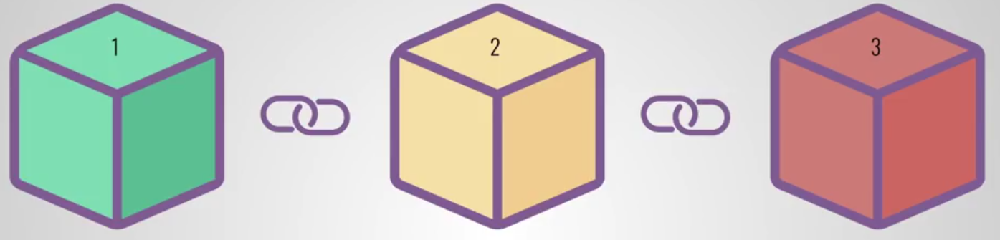

# Proof of Authority Blockchain
Custom testnet blockchain to send a transaction

-----

## Overview
Create a custom testnet using blockchain tech for ZBank. This testnet requires no real money allowing us to experiment without constraints and allows offline development.

-----

## Software Required
1. Puppeth - generate genesis blocks
2. Geth - generate and initialze nodes and keys
3. Clique - Proof of Authority algorithm

All can be downloded as a package at [Go Ethereum](https://geth.ethereum.org/). Download **"Geth & Tools 1.9.7"**.

4. MyCrypto Wallet - App to store money

Download at [MyCrypto](https://download.mycrypto.com).

------------

## Steps to Transact
1. Copy the blockchain folder from the repo.

2. Start node1

    1. Navigate to the downloaded blockchain folder in terminal.

    2. Copy and paste the following command in terminal:

        ./geth --datadir node1 --unlock "c7BF52a240018d532161A0800510D6d1681545a5" --mine --rpc --allow-insecure-unlock

    3. Find the "enode" address and copy and paste it somewhere for future reference

    4. Let it run

3. Start node2

    1. In a new terminal navigate to the blockchain folder again.

    2. Copy and Paste the following command:

        ./geth --datadir node2 --unlock "878e2F13F474aa5eC95dCB915715fB50E78bb856" --mine --port 30304 --bootnodes "paste entire enode address from step 2, starting with enode" --ipcdisable --allow-insecure-unlock

    3. Let it run

4. Send a transaction

    1. Open MyCrypto

    2. Set up local custom network, you can choose the name you want. **Chain ID is 234**

        

    3. Select Keystore file and navigate to node1 keystore file to add node1 to the wallet.

    4. Enter the address where you want to send zbankcoin and the amount.

    5. HIT SEND!

    6. Check the status using tx status.

        

-----

## Sources

* Header Image - https://www.ngfcet.com/blog-article/blockchain-technology-explained
* Trilogy Fintech Bootcamp at Rice University

-----

## Contributors

* Asif Meghani [LinkedIn](www.linkedin.com/in/asif-meghani-26a2a719)

-----

## License
MIT License

----

